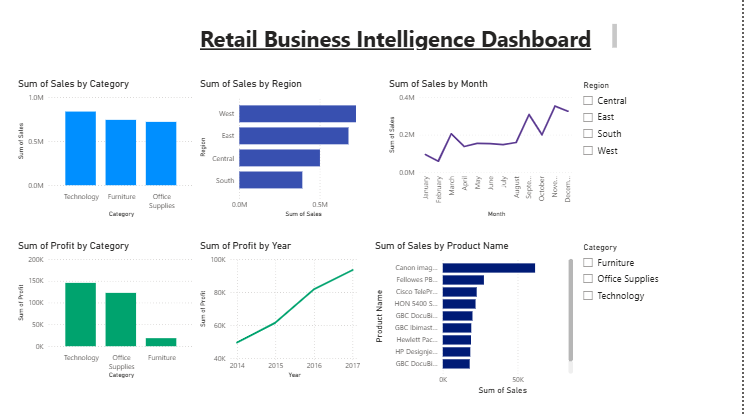

# 📊 Retail Business Intelligence Dashboard

## 📌 Project Overview
This project focuses on analyzing retail sales data to uncover meaningful business insights using Python and Power BI. The dataset was cleaned, explored, and transformed in Python before creating an interactive Power BI dashboard for visualization.

The goal of this project is to help businesses understand sales performance, profitability, regional trends, and product performance through data-driven insights.
## 📊 Power BI Dashboard


---

## 🚀 Streamlit Dashboard

An interactive Python-based dashboard built with Streamlit for exploring retail sales, profit, orders, customers, categories, and state-wise performance.

### Features

- Interactive State and Category filters
- Sales and Profit KPIs
- Sales by Category
- Profit by Category
- Top 10 States by Sales
- Monthly Sales Trend
- Filtered data preview

### ▶️ How to Run

Install the required dependencies:
```bash
       pip install -r requirements.txt
```
Run the Streamlit dashboard:
```bash
   python -m streamlit run streamlit/app.py
```

### Project Objectives       

- Clean and preprocess raw retail data
- Perform Exploratory Data Analysis (EDA)
- Identify sales and profit trends
- Analyze product and regional performance
- Build an interactive Power BI dashboard
- Generate business insights for decision-making

---

## 🛠️ Tools & Technologies

- Python
- Pandas
- NumPy
- Matplotlib
- Jupyter Notebook
- Power BI
- Git
- GitHub

---

## 📂 Dataset

**Dataset:** Sample Superstore Dataset

---

## 📁 Project Structure

Retail-Business-Intelligence-Platform/
│
├── data/
│ ├── raw/
│ └── cleaned/
│
├── notebooks/
│ └── 01_Data_Cleaning.ipynb
│
├── powerbi/
│ └── Retail_Business_Intelligence_Dashboard.pbix
│
├── images/
│ └── dashboard.png
│
├── README.md
└── requirements.txt

---

## 📊 Dashboard Features

- Sales by Category
- Profit by Category
- Sales by Region
- Monthly Sales Trend
- Yearly Profit Trend
- Top 10 Products by Sales
- Interactive Filters (Region & Category)

---

## 📈 Key Insights

- Technology generated the highest sales.
- Some categories had high sales but comparatively lower profit.
- Sales performance varied across different regions.
- A small number of products contributed significantly to total sales.
- Monthly sales trends revealed seasonal business patterns.

---

## 🚀 Future Improvements

- Add DAX Measures
- KPI Cards
- Customer Segmentation
- Sales Forecasting
- Drill-through Reports

---

## 👩‍💻 Author

**Kratika Ojha**

B.Tech in Data Science

---

⭐ If you like this project, feel free to star the repository.
